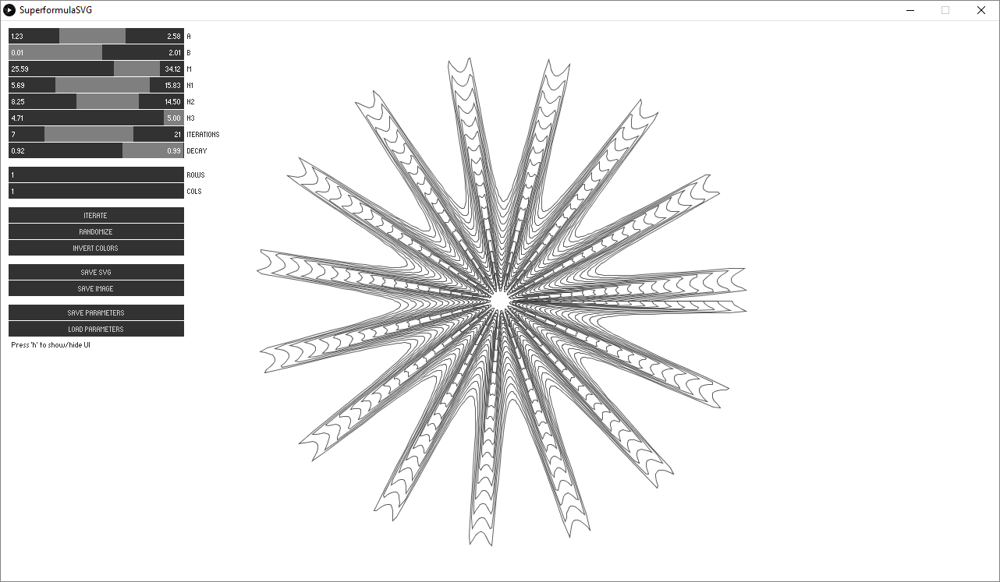
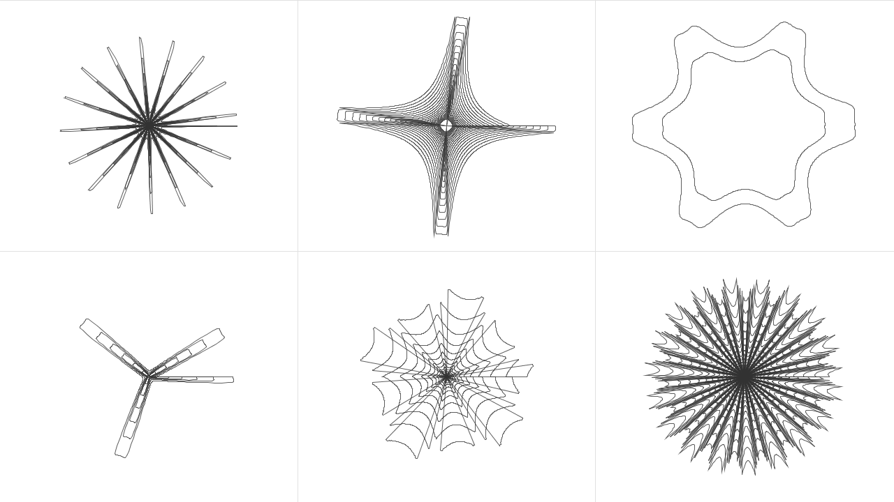
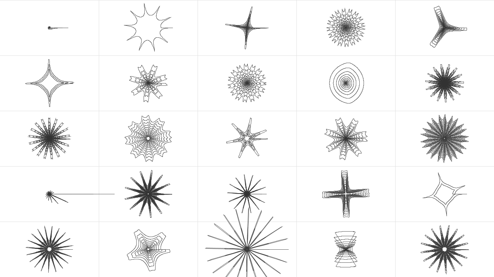

# SuperformulaSVG

Generative [superformula](https://en.wikipedia.org/wiki/Superformula) vector-based line-art sketch for Processing, supporting both SVG and raster image output.

Uses some core code provided by [Form+Code](http://formandcode.com/code-examples/visualize-superformula).

## About the superformula

The superformula is a mathematical method for generating radial geometry with diverse, often organic-looking features. It is described by the following formula:

Where __&phi;__ (phi) is an angle (between 0-359) and the resulting value `r` being the radius of the geometry at that angle.

Here is how I like to think of the parameters and how they affect the resulting drawing:
* `a` seems to affect lateral stretching
* `b` seems to affect vertical stretching
* `m` affects the degree of rotational symmetry. Large values means more peaks/spikes.
* `n1`, `n2`, `n3` all affect the concavity/convexity of spikes and how far they extend from the center. In tandem the can be used to make the form more 'bloated' or 'pinched'.

Following the example set by the original [Form+Code example](http://formandcode.com/code-examples/visualize-superformula) I also include the ability to run multiple iterations of the superformula with slightly changing (decaying) parameter values. You can control these parameters using the `iterations` and `decay` sliders.

Learn more about the superformula through:
* Daniel Shiffman's [Coding Challenge #23: 2D Supershapes](https://www.youtube.com/watch?v=ksRoh-10lak).
* [Wikipedia entry on supershapes](https://en.wikipedia.org/wiki/Superformula) (also relevant is the [superellipse](https://en.wikipedia.org/wiki/Superellipse) page).
* Paul Bourke's article ["Supershapes (Superformula)"](http://paulbourke.net/geometry/supershape/)

## Keyboard commands:
* `Space` = trigger a new iteration
* `s` = save an SVG containing all geometry on screen
* `i` = save an image (PNG) of the current screen
* `r` = randomize parameters
* `n` = invert colors
* `h` = hide/show UI
* `p` = save parameters to JSON file
* `l` = load parameters from JSON file

## Screenshots

