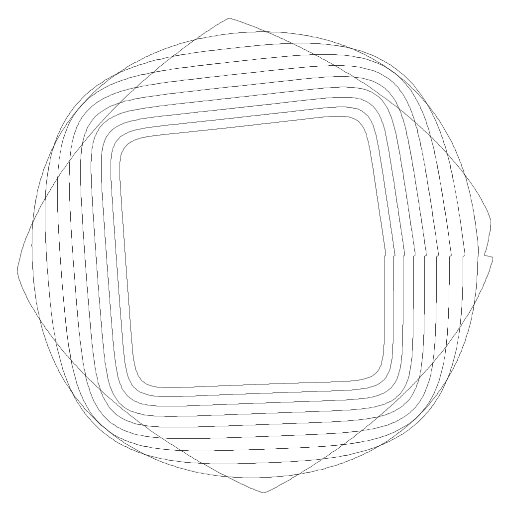
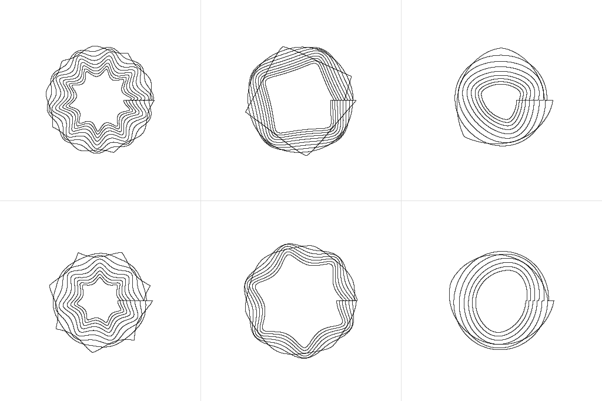

# SuperformulaSVG

Generative superformula line-art generator built in Processing, supporting vector output using Geomerative.

Based on code provided by Form+Code: http://formandcode.com/code-examples/visualize-superformula

---

### Keyboard commands:
* __Space__ = trigger a new iteration
* __s__ = save an SVG containing all geometry on screen
* __i__ = save an image (PNG) of the current screen

---

### Examples

